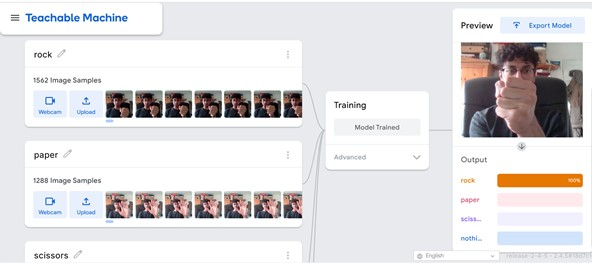
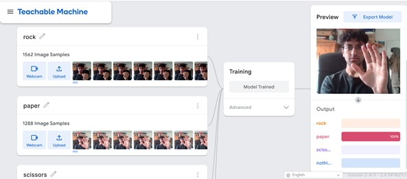
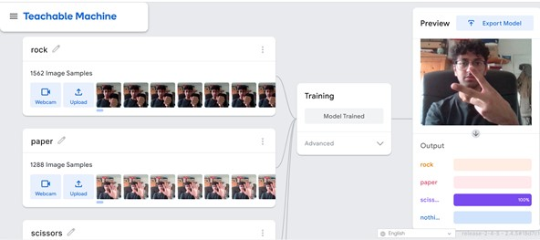
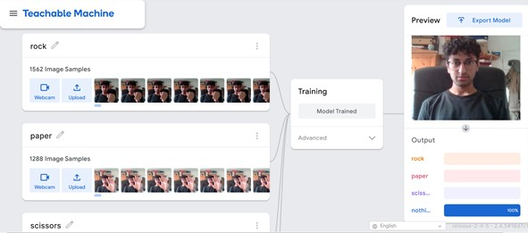
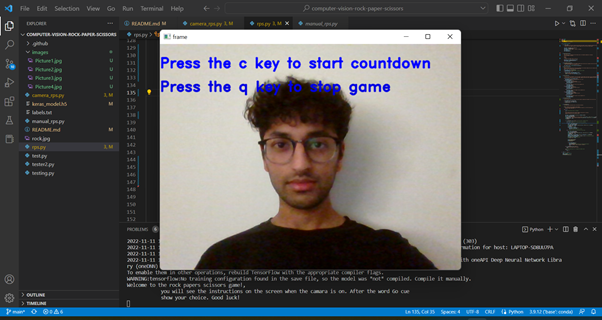
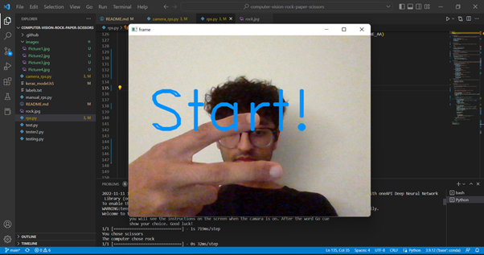
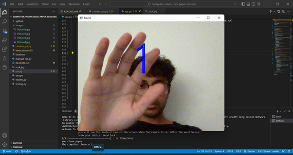

# Computer Vision RPS

I have created an image project model on Teachable-machine with four different classes: rock, paper, scissors, and nothing.Each class is trained with images of myself showing each option to the camera. The "Nothing" class represents the lack of option in the image. The more images I train with, the more accurate the model will be. I took around 1000 images for each class in different positions of the same action.

I will later use this model named keras_model.h5 and the text file containing the labels named labels.txt. Which, contain the structure and the parameters of a deep learning model. They are not files that can be run, and they do not contain anything readable if you look inside. Later, I will load them into my Python application in the next milestone. 

# Milestone 1

Firstly, to setup my enviroment I first created a github repository called computer-vision-rock-paper-scissors project. 

# Milestone 2

To start creating the model on Teachable machine. Each class is trained with images of yourself showing each option to the camera. The "Nothing" class represents the lack of option in the image. Remember that the more images you train with, the more accurate the model will be. I then downloaded the model. The folowing pictures show examples of each class and their actions.

* Rock

* Paper

* Scissors

* Nothing

# Milestone 3

Initially, created a new conda enviroment virtual enviroment named my_env. Before I could use the model I made in Teachable machine, I had to install the libraries that it depends on using pip install <library>. Making sure I installed installed ipykernel a package that provides a IPython kernel for Jupyter. I then checked if my downloaded model was working using the library openCV, Tensorflow and Keras.

# Milestone 4

I then proceeded to code the rock, paper, scissors game. The code initialy selects randomly an option from the list rock, paper or scissors. Secondly, I created two functions names get_computer_choice() and get_user_choice(). The first function will randomly pick an option between "Rock", "Paper", and "Scissors" and return the choice. The second function will use the choice from the camera input.

Using if-elif-else statements, the script now choose a winner based on the classic rules of Rock-Paper-Scissors. . I wrapped this code in a function called get_winner and returned the winner in each round. Subsequently, I created a function called play_game(). Inside this function I called all the other three functions I created (get_computer_choice(), get_user_choice(), and get_winner())). When I run the code, it plays the game of Rock-Paper-Scissors, and it prints whether the computer or you won.

# Milestone 5 

Finally I created a class called rock_paper_scissors() which contains all the previous functions including a new function called get_prediction that will return the output of the model I used earlier and a get_game_winner() function which returns the winner of the whole game. In addition, it introduces a new functionality that displays a countdown timer (3, 2, 1, Start!) at the start of each round. I integrated the model code earlier which prints the countdown in the webcam display, including a message "press c to continue" and q to stop using the cv2.putText() function. Also in the function, after three rounds the game winner is printed.

The following shows some images of the game in practice including the coutndown and hand signs:

# Conclusion

The computer vision project uses the classic rock paper scissors game. A future version of this game could benifit from additional improvements such as:

* Making an interactive textbox on the camera screen to offer a choice on how many rounds the user wants to play.

* Creating a 2 player game, the user could get a choice whether to play against the computer or with another person.

* Dispaying a textbox with the round number on the screen as well as the round winner for each round.

* Asking the user at the end of the game if they would like to play again and starting the countdown again.

* Creating a user interface that allows the user to press a 'next' button one the screen to begin a new round.

* Adding the option of creating new hand signs as oppose to rock paper and scissors or an additional class.

